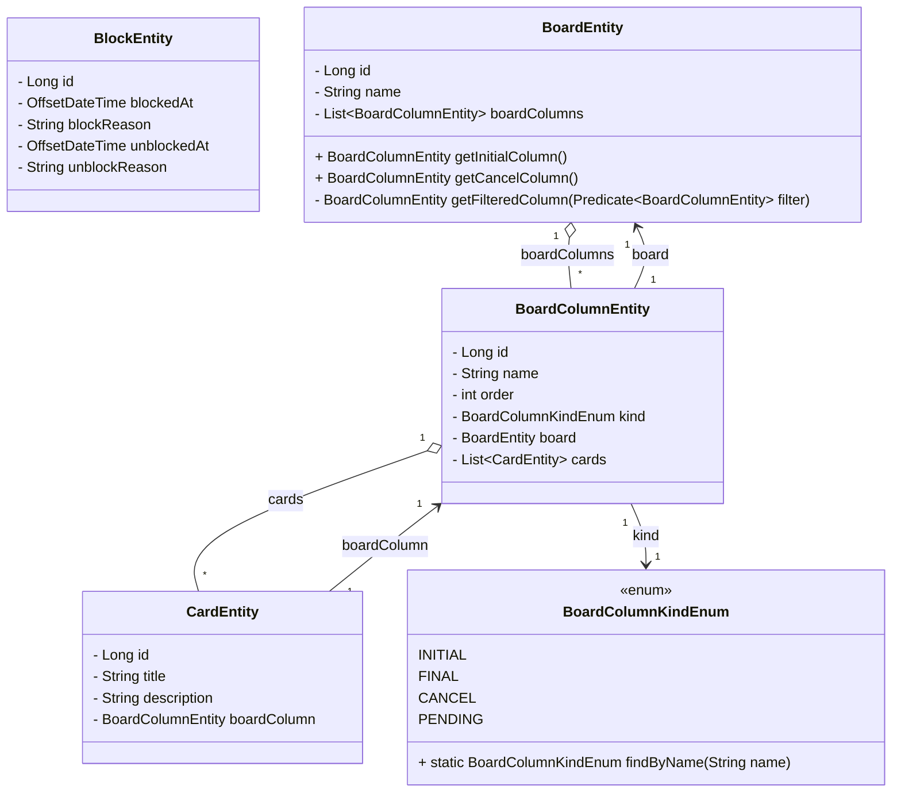

Digital Innovation One
  

## Criando um board de tarefas Java  

```mermaid
classDiagram
    class BlockEntity {
        - Long id
        - OffsetDateTime blockedAt
        - String blockReason
        - OffsetDateTime unblockedAt
        - String unblockReason
    }

    class BoardColumnKindEnum {
        <<enum>>
        INITIAL
        FINAL
        CANCEL
        PENDING
        + static BoardColumnKindEnum findByName(String name)
    }

    class BoardEntity {
        - Long id
        - String name
        - List~BoardColumnEntity~ boardColumns
        + BoardColumnEntity getInitialColumn()
        + BoardColumnEntity getCancelColumn()
        - BoardColumnEntity getFilteredColumn(Predicate~BoardColumnEntity~ filter)
    }

    class BoardColumnEntity {
        - Long id
        - String name
        - int order
        - BoardColumnKindEnum kind
        - BoardEntity board
        - List~CardEntity~ cards
    }

    class CardEntity {
        - Long id
        - String title
        - String description
        - BoardColumnEntity boardColumn
    }

    BoardEntity "1" o-- "*" BoardColumnEntity : boardColumns
    BoardColumnEntity "1" o-- "*" CardEntity : cards
    BoardColumnEntity "1" --> "1" BoardEntity : board
    CardEntity "1" --> "1" BoardColumnEntity : boardColumn
    BoardColumnEntity "1" --> "1" BoardColumnKindEnum : kind
```
